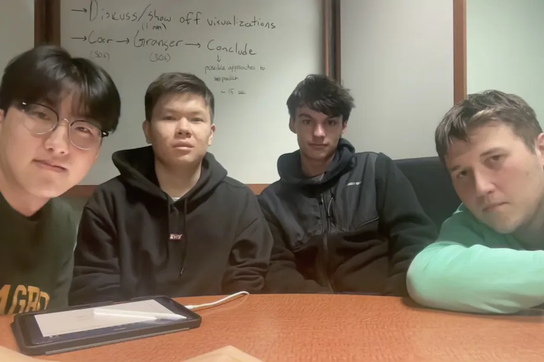

# Inspiration

We wanted a fun data-based challenge, one that would test all of our skills while still being doable with what we had. Plus, we enjoy baseball.

# What it does

It looks into the correlation between factors surrounding travel and team performance.

# Challenges we ran into

Ways to accurately prove the existence or non-existence of relationships.
Accomplishments that we're proud of

Our visualization for season-by-season data.

# What we learned

One of the more interesting methods we learned about was Granger Causation

#Citations

https://www.baseball-reference.com/bullpen/OPS
We are citing this baseball reference article, where we got the equation for OPS+

